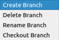
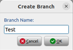
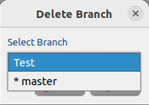
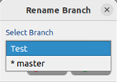
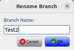
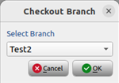
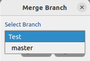
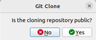
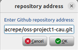

# oss-project1-cau 
2023-1 Open Source SW Project 1

## Original source code
* [QFilemanager](https://github.com/Axel-Erfurt/QFilemanager) by Axel-Erfurt

## How to install
* **[OS]** Ubuntu 22.04.2
* **[Requirements]** Python3, PyQt5, PyQtWebEngine, send2trash, GitPython 3.1.31
* **Ubuntu language: English**
```
sudo apt install python3  
sudo apt install python3-pip  
pip3 install PyQt5  
pip3 install PyQtWebEngine  
pip3 install send2trash
pip3 install GitPython
sudo apt-get install --reinstall libxcb-xinerama0 

sudo apt install git  
git config –-global user.name [username]
git config --global user.email [you@example.com]
git clone https://github.com/teacrepe/oss-project1-cau.git 
cd oss-project1-cau  
cd QFilemanager  
python3 QFileManager.py
```

### When Error occurred during installation
reinstall [requirements] after executing the following command 
```
sudo apt update
pip3 install --upgrade pip
pip3 install wheel setuptools pip --upgrade
```

## functionality
**1. [toolbar] git init & git commit button**
- git init button: If pressed in a folder not managed by Git, Git starts managing it.  
  
- git commit button: When you press the button, information about the Git stage to be committed is displayed. After pressing OK and writing the commit message, the commit is executed.  
  

**2. git status icon**
It displays the git status on the left side of each file.
- commited 
- modified 
- staged 
- untracked 
- staged_modified 
- staged_untracked 

**3. context menu**
When you right-click on each file, a menu corresponding to the git status of that file will appear.
- for untracked files:  
    git add  
- for modified files:   
    git add  
    git restore  
- for staged files:  
    git restore --staged  
- for committed or unmodified files:  
    git rm --cached  
    git rm  
    git mv  
- for staged_modified files:  
    git add  
    git restore  
- for staged_untracked files:  
    git add   

**4. refresh**  
Pressing F5 refreshes the git status.  

**5. [toolbar] git branch dropbox**  
You can select one of the following options (create branch, delete branch, rename branch, checkout branch) and execute it using the git branch button.
- git branch drop box  
  
- git branch button  
  
- create branch  
  
- delete branch  
  
- rename branch  
  
  
- checkout branch  
  
  
**6. [toolbar] git merge button**  
When you press the button, a screen will appear where you can select the branch you want to merge. Once you make the selection, the merge will be executed.  
  
  

**7. [toolbar] git clone button**  
When you press the button, it asks whether the repository you want to clone is public and prompts you to enter the repository address.  
  
  
  

**8. [toolbar] git commit history button**  


## commit convention
Message format: [Commit type] [Message] [#Issue]

### type of the Commit:
- feat
- debug
- refactor
- chore
- build
- docs
